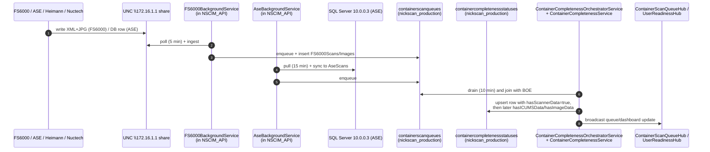
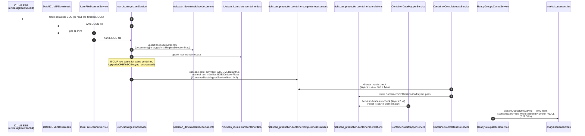
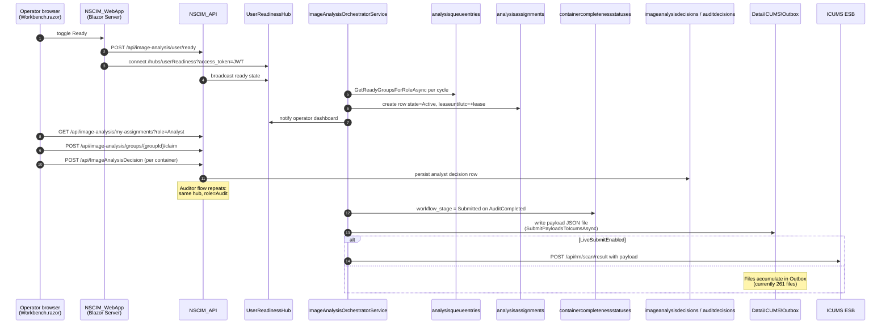

# 01 — Topology

**Audit:** NSCIM v1 cold audit, 2026-05-05
**Agent:** Topology
**Scope:** Read-only canonical map of NSCIM v1 production. This document is the
shared reference the other 7 agents cite. All claims here are evidenced by file
paths, line numbers, command output, or live DB query results captured during
the audit window.

> Version of record: `src/Directory.Build.props` → `2.16.3`. Probed
> 2026-05-05 against the running services and live Postgres cluster
> (PostgreSQL 18, `localhost:5432`).

## Scope confirmation

This pass exhaustively documents (a) the seven Windows services and one
Python child process that make up the running stack, (b) their bind URLs,
auth schemes and health endpoints, (c) the five Postgres databases plus the
remote SQL Server, (d) every persistent queue surface — table-shaped and
file-shaped — (e) every `BackgroundService` / `IHostedService`
implementation with its registration and cadence, (f) the frontend↔backend
contract surface for the operator workflow pages, (g) the auth / session
model, (h) the six-layer match-correctness model mapped to file:line, (i)
the deploy harness, and (j) the live config-resolution graph.

Out of scope: bug-hunting (other agents own that), NickHR/NickFinance/
NickComms internals (their boundary into the cargo pipeline is documented
as a topology fact only), and v2 (`C:\Shared\ERP V2\`).

## A. Service inventory

Probed via `Get-Service`, `sc.exe qc`, `Get-Process -Id <pid>`, and
`Get-NetTCPConnection -State Listen`. **All seven services are now
sc.exe-managed**, not NSSM-managed — `nssm get <svc> AppDirectory` returns
`"Parameter ... is only valid for services managed by NSSM"` for every one
of them, and `Deploy.ps1`'s `Set-NssmEnvPair` helper short-circuits the
NSSM path on probe failure (lines 304–315). The standalone
`NSCIM_ImageSplitter` and `NSCIM_Mobile` services have been **removed**:
`sc.exe query NSCIM_Mobile` and `sc.exe query NSCIM_ImageSplitter` both
return `1060: The specified service does not exist as an installed
service`.

| Service | Port(s) | binPath | Account | Csproj | Hosts |
|---|---|---|---|---|---|
| `NSCIM_API` | **5205** http, **5206** https | `C:\Shared\NSCIM_PRODUCTION\publish\API\NickScanCentralImagingPortal.API.exe` | `LocalSystem` | `src/NickScanCentralImagingPortal.API/NickScanCentralImagingPortal.API.csproj` | API host + 35 `IHostedService` workers + 5 SignalR hubs + Python ImageSplitter (child process) |
| `NSCIM_WebApp` | **5299** http, **5300** https | `C:\Shared\NSCIM_PRODUCTION\publish\WebApp\NickScanWebApp.New.exe` | `LocalSystem` | `src/NickScanWebApp.New/NickScanWebApp.New.csproj` | Blazor Server WebApp |
| `NSCIM_NickComms` | **5220** http | `C:\Shared\NSCIM_PRODUCTION\publish\NickComms\NickComms.Gateway.exe` | `LocalSystem` | `services/NickComms.Gateway/NickComms.Gateway.csproj` | API-key-authed SMS/email gateway, postgres outbox |
| `NSCIM_Portal` | **5400** http (`::1` + `127.0.0.1` only) | `C:\Shared\NSCIM_PRODUCTION\publish\Portal\NickERP.Portal.exe` | `LocalSystem` | `platform/NickERP.Portal/NickERP.Portal.csproj` | NickERP launcher / app cards, Blazor SSR |
| `NickHR_API` | **5215** http | `C:\Shared\NSCIM_PRODUCTION\NickHR\deploy\api\NickHR.API.exe` | `LocalSystem` | `NickHR/src/NickHR.API/NickHR.API.csproj` | NickHR domain API |
| `NickHR_WebApp` | **5310** http, **5311** https | `C:\Shared\NSCIM_PRODUCTION\NickHR\deploy\webapp\NickHR.WebApp.exe` | `LocalSystem` | `NickHR/src/NickHR.WebApp/NickHR.WebApp.csproj` | NickHR Blazor WebApp |
| `NickFinance_WebApp` | **5500** http (`::` only) | `C:\Shared\NSCIM_PRODUCTION\publish\NickFinance.WebApp\NickFinance.WebApp.exe` | **`NT SERVICE\NickFinance_WebApp`** | `finance/NickFinance.WebApp/NickFinance.WebApp.csproj` | NickFinance Blazor WebApp |

**Note** — `NickFinance_WebApp` is the *only* service that does NOT run as
`LocalSystem`. It runs under a virtual service account
(`NT SERVICE\NickFinance_WebApp`). It also reads `nickhr` (yes, the same
DB the HR module owns) via `Username=nscim_app` (`finance/NickFinance.WebApp/appsettings.json`).
Going to be relevant for the security/perm agent.

### SCM dependencies (post-2.16.1)

`sc.exe qc` shows `DEPENDENCIES :` empty for all seven services. This
matches the 2.16.1 fix in `cbed9f4` that explicitly cleared the
`NSCIM_WebApp` → `NSCIM_API` (and `NickHR_WebApp` → `NickHR_API`)
dependencies via `sc.exe config <svc> depend= /`. `Deploy.ps1` owns
service start/stop ordering by walking the `$SERVICES` array
(API-then-WebApp on full deploys, reverse for stops).

### Auth schemes per service

| Service | Auth schemes accepted | Notes |
|---|---|---|
| `NSCIM_API` | Cookie (`NickScan.Auth`) **OR** JWT bearer, multiplexed via the `"Dual"` policy scheme (`Program.cs:216–237`). Default scheme = `Dual`. | `FallbackPolicy = RequireAuthenticatedUser()` (`Program.cs:370–372`). `[AllowAnonymous]` only on `/api/health`, `/login`, `/api/public/*`, signed-image-URL paths. |
| `NSCIM_WebApp` | Cookie only — Blazor Server. No `[Authorize]` middleware in pipeline; auth is delegated to NSCIM_API via the `ApiService` wrapper. | Cookie name same as NSCIM_API. |
| `NSCIM_NickComms` | API key (`X-Api-Key`) → `ApiKeyAuthHandler` (`services/NickComms.Gateway/Program.cs:auth`). Default scheme = `ApiKeyAuthOptions.SchemeName`. | Configured clients: `nscim-image`, `nickhr` (env-var-overridden in prod). |
| `NSCIM_Portal` | **None** — anonymous Blazor SSR. Only consumes NSCIM_API stats endpoints over HTTP. | Card config is hard-coded in appsettings.json. |
| `NickHR_API` | JWT bearer (`Bearer` scheme). Issuer = `NickHR.API`, audience = `NickHR.Client`. | Single-session enforcement live: same `sid` rotation pattern as NSCIM_API. JWT key from env var `NICKHR_JWT_KEY` (Program.cs:79–100). |
| `NickHR_WebApp` | Cookie (NickHR's own scheme). | Talks to NickHR_API over HTTP. |
| `NickFinance_WebApp` | Anonymous (no `AddAuthentication` in Program.cs). | Single-tenant (DefaultTenantId=1) phase-0 deploy. |

### Health endpoints

| Service | Health URL(s) |
|---|---|
| `NSCIM_API` | `GET /health`, `GET /health/live`, `GET /health/ready`, UI at `/health-ui` (`Program.cs:1354–1382`) |
| `NSCIM_WebApp` | `GET /health` (`Program.cs:361`) |
| `NSCIM_NickComms` | `GET /api/health` (`Program.cs:172`) |
| `NSCIM_Portal` | none |
| `NickHR_API` | `GET /api/health` (anonymous), `/api/health/live`, `/api/health/ready` (`Program.cs:280–286`). **NB:** `Deploy.ps1` and the NSCIM_API downstream-probe map use `/api/_module/manifest` instead — see `appsettings.json:HealthChecks.NickHRHealthUrl`. |
| `NickHR_WebApp` | none probed |
| `NickFinance_WebApp` | none probed |

## B. Database inventory

Probed live via the audit's `nscim_app` Npgsql client
(`C:\temp\nscim-probe\TopoProbe.cs` ... `TopoProbe5.cs`). Every probe ran
`SET LOCAL app.tenant_id = '1'` first. Five Postgres DBs + one remote SQL
Server.

| Database | Host | App user | Tables | RLS-forced | RLS-enabled-only | RLS-off |
|---|---|---|---|---|---|---|
| `nickscan_production` | `localhost:5432` | `nscim_app` | 83 | 80 | 0 | **3** (`__EFMigrationsHistory`, `analysisqueueentries`, `splitter_consensus_corpus`) |
| `nickscan_icums` | `localhost:5432` | `nscim_app` | 5 | 4 | 0 | 1 (`__EFMigrationsHistory`) |
| `nickscan_downloads` | `localhost:5432` | `nscim_app` | 12 | 11 | 0 | 1 (`__EFMigrationsHistory`) |
| `nick_comms` | `localhost:5432` | `nscim_app` | 5 | 4 | 0 | 1 (`__EFMigrationsHistory`) |
| `nickhr` | `localhost:5432` | `nscim_app` (NickHR.API) **and `postgres`** (NickHR.WebApp) | 97 | 96 | 0 | 1 (`__EFMigrationsHistory`) |
| `networking` (SQL Server) | `10.0.0.3` | `cias` | n/a | n/a | n/a | n/a |

**Critical RLS gap:** `analysisqueueentries` in `nickscan_production` has
`relrowsecurity=False`, `relforcerowsecurity=False`, and **zero
`pg_policy` entries** (queries below). It's the only operationally-active
table in the production DB without RLS. The orchestrator writes/reads it
without a tenant scope. Surfaced here for the DB-integrity agent (07) and
the assignment-pipeline agent (04) to evaluate.

```
## RLS state of all 'queue' tables
  relname               | relrowsecurity | relforcerowsecurity
  containerscanqueues   | True           | True
  icumsdownloadqueues   | True           | True
  icumssubmissionqueues | True           | True
  analysisqueueentries  | False          | False
```

### Cross-DB join boundaries

The NSCIM API uses three EF DbContexts:

- `ApplicationDbContext` → `nickscan_production`
- `IcumDbContext` (or similar) → `nickscan_icums`
- `IcumDownloadsDbContext` → `nickscan_downloads`

A typical match-correctness flow touches all three: completeness lives in
`nickscan_production.containercompletenessstatuses`, the BOE document is in
`nickscan_downloads.boedocuments`, and the JSON staging payload is in
`nickscan_icums.icumcontainerdata`. Cross-DB queries are **not** single
SQL statements — the C# code reads from one context and joins in memory
(see `IcumJsonIngestionService.CascadeCMRUpgradeAsync` at line 1427: it
opens one `ApplicationDbContext` scope to update CCS while iterating a
`BOEDocument` from a different DB).

The downstream SQL Server `networking` (10.0.0.3) is owned by ASE — it
holds the operational scan database that the ASE scanner writes to. NSCIM
syncs *from* it via `AseDatabaseSyncService` (background) and *queries* it
on demand from controllers via the same ConnectionString. Schema is
"theirs"; nothing in NSCIM mutates `networking`.

### Live cardinalities (snapshot at probe time)

```
[nickscan_production] AnalysisGroups by Status
  status     | n
  Archived   | 31
  Cancelled  | 14
  Completed  | 2617
  Ready      | 16

[nickscan_production] AnalysisAssignments by State
  state     | n
  Expired   | 9235
  Released  | 2089
  Cancelled | 113
  -- 0 Active

[nickscan_production] AnalysisQueueEntries cardinality = 0
[nickscan_production] AnalysisSubmissions cardinality = 750
[nickscan_production] ICUMSSubmissionQueues cardinality = 0
[nickscan_production] ICUMSDownloadQueues cardinality = 55
[nickscan_production] ContainerScanQueues cardinality = 8425
[nickscan_production] containerboerelations: 3092 rows / 3071 distinct CN

[nickscan_downloads] icumsdownloadqueue:
  status    | n
  Completed | 20

[nickscan_downloads] cmrredownloadqueue: 0
[nickscan_downloads] failedprocessingqueue: 0
[nickscan_downloads] boedocuments by documenttype:
  documenttype | n
  BOE          | 25918
  Free Zone    | 817
  Transit      | 6552
  (null)       | 86381   -- predominantly CMR pre-decs (per CHANGELOG 2.16.0)

[nickscan_icums] icumcontainerdata = 106864
[nick_comms]     sms_messages: failed=4 ; email_messages: sent=50
[nickhr]         users: 7 total / 7 active
```

`AnalysisQueueEntries=0` is operationally significant: with 16 Ready AGs
and only 1 Analyst marked ready in `userreadiness`, the orchestrator's
queue-materialization step should be re-populating this table on every
cycle — and isn't. Flagged for agent 04 (Assignment).

## C. Queue tables map

Two parallel queue families. Persistent tables in Postgres + a file-based
ICUMS Outbox on disk.

| Surface | Schema | DB | Writers | Readers | State machine |
|---|---|---|---|---|---|
| `analysisqueueentries` | `groupid uuid` PK, `groupidentifier`, `status`/`groupstatus`, `assignmentid`, `assignedto`, `role`, `leaseuntilutc`, `containercount`, `containersjson`, `submittedcontainercount`, `pendingcontainercount`, `decidedcount`, `partiallycompleteddate`, `isconsolidated`, `queuedatutc`, `lastrefreshedatutc` (23 cols) | `nickscan_production` | `ReadyGroupsCacheService.UpsertQueueEntryAsync`, `ImageAnalysisOrchestratorService` | `ReadyGroupsCacheService.GetReadyGroupsForRoleAsync`, Workbench/AuditReview API endpoints | `groupstatus` is the assignment-eligibility gate (`Ready` for analysts, `AnalystCompleted` for auditors) |
| `analysisassignments` | `id`, `groupid uuid`, `assignedto`, `role`, `leaseuntilutc`, `state`, `createdatutc`, `updatedatutc`, `lastaccessedatutc`, `tenant_id` (10 cols) | `nickscan_production` | `AssignmentWorker` (now inlined in orchestrator), API `/api/image-analysis/groups/{id}/claim` | Workbench/AuditReview UI via `/api/image-analysis/my-assignments?role=...` | `state ∈ {Active, Released, Expired, Cancelled}` (no `Status` column despite what the prior memory note implied) |
| `analysissubmissions` | submission-tracking rows | `nickscan_production` | submission worker (orchestrator block) | reports / metrics | `submittedat IS NULL` ≡ unsent |
| `containerscanqueues` | scanner→completeness pipeline queue | `nickscan_production` | `FS6000BackgroundService`, `AseBackgroundService`, scanner intake | `ContainerCompletenessOrchestratorService.ContainerCompletenessService` | enqueued from XML / DB-sync, drained as CCS rows are populated |
| `icumssubmissionqueues` | post-decision submission staging | `nickscan_production` | `ContainerDataMapperService` | `ICUMSSubmissionService` (drains every `ICUMS.SubmissionIntervalMinutes`, default 10 min) | currently empty |
| `icumsdownloadqueues` | NSCIM-side mirror of pending ICUMS fetches (per-container) | `nickscan_production` | `ManualBOESelectivityService`, retry sweepers | `ICUMSDownloadBackgroundService` (drained inside the orchestrator) | 55 rows in flight |
| `icumsdownloadqueue` (singular) | downloads-side mirror — separate DB, semi-redundant | `nickscan_downloads` | `ICUMSDownloadQueueService` | same | only Completed=20 currently |
| `cmrredownloadqueue` | CMR re-fetch queue | `nickscan_downloads` | `CMRRedownloadBackgroundService` | same | empty |
| `failedprocessingqueue` | dead-letter for ICUMS files that failed parsing | `nickscan_downloads` | `FailedFileRetryService` | retry sweep | empty |
| `image_split_jobs` / `image_split_assignments` / `image_split_results` | Python splitter coordination tables | `nickscan_production` | `MultiContainerValidationService.SubmitSplitJobForCrossRecordAsync` (and the Python service back-writes results) | analyst viewer | per `crossrecordscans.splitjobid` linkage (2.15.4 added the column) |
| `crossrecordscans` | detected multi-container composites | `nickscan_production` | `MultiContainerValidationService.CreateCrossRecordTrackingAsync` | analyst viewer | `splitjobid` ties to splitter |
| **ICUMS Outbox (file-based)** | `C:\Shared\NSCIM_PRODUCTION\Data\ICUMS\Outbox\*.json` (**261 files** at probe time) | filesystem | `ImageAnalysisOrchestratorService.SubmitPayloadsToIcumsAsync` writes (line 2148+); historical `SubmissionWorker` writer kept around but unhosted | same orchestrator on retry sweeps (`Outbox` retry path, see `ImageAnalysisOrchestratorService.cs:1688–1764`); successful POST flips CCS `WorkflowStage` to `Submitted`. | `LiveSubmitEnabled` flag controls the HTTP POST; if false, files accumulate. Currently `false` per `appsettings.json:208` and DB `systemsettings` not overriding. |

`AnalysisAssignments` is "semi-queue" because it's row-by-row per
operator-claim, but the orchestrator's lease-sweeper (`Reclaim` /
`ExpireAssignmentsInBatches` in the orchestrator's lifted-from-AssignmentWorker
methods) treats it as a queue: pick up `state='Active' AND leaseuntilutc < now`
rows, transition them. The 2.16.1 orphan-AG guard added a third terminal
state (`Cancelled`) to break the lease cycle for groups whose underlying
containers have no actionable BOE.

## D. BackgroundService inventory

Every `BackgroundService` / `IHostedService` implementation in v1, plus the
single `[hosted]` registration site for each. Probed via Grep for
`: BackgroundService` and `: IHostedService` (43 unique classes), then
cross-referenced against the registration sites
(`ServiceConfiguration.cs:AddBackgroundServices()`,
`ServiceConfiguration.cs` standalone calls, and `Program.cs:171–773`). All
of them run inside **NSCIM_API** — no other v1 service registers any
hosted services.

| Class (file) | Cadence | Failure mode | Description |
|---|---|---|---|
| `ImageSplitterSupervisorService` (`Services/ImageSplitter/...:61`) | child boots `~10s` after API healthy; healthcheck poll 60 s; backoff 3→6→12→24→cap60 s | log + restart; kills hung child if unresponsive >20 s | Owns the Python image splitter lifecycle (lines 152–260). Streams stdout/stderr into Serilog as `[SPLITTER]` / `[SPLITTER/err]`. |
| `ImageAnalysisOrchestratorService` (`Services/ImageAnalysis/ImageAnalysisOrchestratorService.cs:25`) | adaptive (15s–5min) per workflow | catch+log per workflow; `_lastIntakeError` exposed to health checks | Master loop. Folds Bootstrapper → Intake → DecisionAgent → Assignment → Submission → Housekeeping into one process. Reads `AnalysisSettings.Enabled` to gate. |
| `AssignmentWorker` (`AssignmentWorker.cs:14`) | **NOT REGISTERED** in `Program.cs` or `ServiceConfiguration.cs` | n/a | Dead code. Logic was lifted into the orchestrator. File still compiles + linked but has no `AddHostedService` call. |
| `SubmissionWorker` (`SubmissionWorker.cs:17`) | **NOT REGISTERED** | n/a | Same — dead. The Outbox-write path lives in `ImageAnalysisOrchestratorService.SubmitPayloadsToIcumsAsync`. |
| `ImageAnalysisBootstrapper` (`ImageAnalysisBootstrapper.cs:15`) | **NOT REGISTERED** | n/a | Same — dead. Bootstrapping runs once in `ImageAnalysisOrchestratorService.RunBootstrapperAsync` on startup. |
| `ZombieAnalysisGroupSweeperService` (`ZombieAnalysisGroupSweeperService.cs:41`) | 2 min | log+continue | Archives `AnalystCompleted` groups with zero CCS rows after a grace window. |
| `UserReadinessSyncService` (`UserReadinessSyncService.cs:20`) | per `Program.cs:744` | log+continue | Mirrors SignalR ready-state into `userreadiness` table. |
| `IcumPipelineOrchestratorService` (`IcumApi/IcumPipelineOrchestratorService.cs:24`) | 30 s loop / 5-min retry on error | log+continue | Master ICUMS pipeline coordinator (replaces 4 retired workers per `appsettings.json:280–303`). |
| `IcumJsonIngestionService` (`IcumApi/IcumJsonIngestionService.cs:18`) | configurable, default 1 min, 45 s startup delay | per-file try/catch | Parses ICUMS JSON from `Data\ICUMS\Downloads\` into `nickscan_downloads.boedocuments` and into `nickscan_icums.icumcontainerdata`. Owns the CMR→IM cascade gate (`CascadeCMRUpgradeAsync` at line 1427, with port-rule carve-out at line 1442). |
| `IcumFileScannerService` (`IcumApi/IcumFileScannerService.cs:12`) | configurable, default 1 min | log+continue | File-system poll of `Data\ICUMS\Downloads`. |
| `IcumDataTransferService` (`IcumApi/IcumDataTransferService.cs:9`) | 5 min | log+continue | Transfers from `nickscan_downloads` into `nickscan_production`. |
| `IcumFileArchiveService` (`IcumApi/IcumFileArchiveService.cs:17`) | unspecified | log+continue | Archives processed ICUMS files. |
| `FailedFileRetryService` (`IcumApi/FailedFileRetryService.cs:14`) | 30 s | log+continue | Retry / DLQ sweep for ingestion failures. |
| `ICUMSMetricsCollectorService` (`IcumApi/ICUMSMetricsCollectorService.cs:13`) | 30 s | log+continue | Updates ICUMS gauge metrics. |
| `ICUMSSubmissionService` (`ContainerCompleteness/ICUMSSubmissionService.cs:17`) | configurable from settings (`BackgroundServices.ICUMS.SubmissionIntervalMinutes`, default 10 min) | per-submission try/catch | Drains `icumssubmissionqueues` for the legacy path. **Note:** the orchestrator now also owns ICUMS Outbox writes — both paths exist. |
| `ContainerCompletenessOrchestratorService` (`ContainerCompleteness/.../ContainerCompletenessOrchestratorService.cs:21`) | 10 min | log+continue | Coordinates completeness, ManualBOE, mapping. |
| `ContainerCompletenessService` (`.../ContainerCompletenessService.cs:19`) | 10 min internally | log+continue | The 6-layer match-correctness gate (queue-time port + fyco rules). **NOTE:** the orchestrator above runs `ContainerCompletenessService` as a scoped service per cycle, so the standalone hosted registration is commented out in `Program.cs:712`. |
| `ContainerDataMapperService` (`.../ContainerDataMapperService.cs:17`) | 5 min | log+continue | Maps to ICUMS submission shape. Belt-and-braces port + fyco rule checks (lines 213–286). |
| `ContainerStatusReconciliationService` (`.../ContainerStatusReconciliationService.cs:15`) | unspecified | log+continue | Heals out-of-sync CCS rows. |
| `PostICUMSValidationService` (`.../PostICUMSValidationService.cs:14`) | runs inside the orchestrator (registration in `Program.cs:733` deliberately removed to prevent duplicate execution) | n/a | Multi-container detection + cross-record tracking creation. |
| `ManualBOESelectivityService` (`.../ManualBOESelectivityService.cs:16`) | 2 min | log+continue | Processes manual BOE re-fetch requests. |
| `QueueRecoveryService` (`.../QueueRecoveryService.cs:25`) | 5 min | log+continue | Repairs stuck queue items. |
| `RecordReconciliationWorker` (`RecordCompleteness/RecordReconciliationWorker.cs:36`) | safety-net pass | log+continue | Catches anything the event-driven `RecordBuildingService` missed (1.14.0). |
| `CMRRedownloadBackgroundService` (`Validation/CMRRedownloadBackgroundService.cs:12`) | 5 min | log+continue | Drains `cmrredownloadqueue`. |
| `CMRMetricsRecorderService` (`Validation/CMRMetricsRecorderService.cs:14`) | 60 min | log+continue | Hourly CMR metric snapshots. |
| `FS6000BackgroundService` (`Services.FS6000/FS6000BackgroundService.cs:11`) | 5 min sync, 1 min ingestion | log+continue | UNC share sync (`\\172.16.1.1\Image\23301FS01` per env var `NICKSCAN_FS6000_SHARE`) + XML/JPG ingestion. |
| `FS6000RawChannelBackfillWorker` (`Services.ImageProcessing/FS6000/...:39`) | unspecified | log+continue | Backfills missing raw channels. |
| `AseBackgroundService` (`ASE/AseBackgroundService.cs:13`) | configurable, default 15 min (`AseConfiguration.SyncIntervalMinutes`) | log+continue | Pulls ASE rows from SQL Server `10.0.0.3` into `nickscan_production`. Reads env var `NICKSCAN_ASE_PASSWORD` via PostConfigure (line 462). |
| `AccessReviewService` (`AccessReview/AccessReviewService.cs:14`) | daily | log+continue | Periodic permission audit. |
| `AiSuggestionAutoTriggerService` (`AiWorkflow/AiSuggestionAutoTriggerService.cs:15`) | 15 s | log+continue | Auto-fire AI suggestions (Claude API or stub provider). |
| `DailyDataQualityReportService` (`Email/DailyDataQualityReportService.cs:12`) | hourly check + 8:00 AM send | log+continue | Generates and emails daily QC report. |
| `MonitoringBroadcastService` (`API/Monitoring/MonitoringServiceExtensions.cs:66`) | unspecified | log+continue | Pushes monitoring data to clients. |
| `ImageAnalysisDashboardBroadcastService` (`API/Hubs/ImageAnalysisDashboardHub.cs:67`) | unspecified | log+continue | SignalR push for dashboard updates. |
| `DashboardBroadcastService` (`API/Hubs/ComprehensiveDashboardHub.cs:90`) | 60 s (per `appsettings.json:341`) | log+continue | Comprehensive dashboard broadcasts. |
| `EndpointUsageBufferService` (`Monitoring/EndpointUsageBufferService.cs:19`) | 10 s flush | log+continue | Batch-writes endpoint usage logs to reduce DB load. |
| `EndpointUsageCleanupBackgroundService` (`Monitoring/EndpointUsageCleanupBackgroundService.cs:12`) | hourly | log+continue | Trims usage log older than 90 days. |
| `DuplicateDownloadMonitoringService` (`Monitoring/DuplicateDownloadMonitoringService.cs:16`) | 30 min (5 min on error) | log+continue | Detects + alerts on duplicate ICUMS downloads. |
| `ErrorMonitoringBackgroundService` (`Monitoring/ErrorMonitoringBackgroundService.cs:19`) | configurable, default 5 min | log+continue | Periodically scans error investigations table. |
| `ComprehensiveHealthCheckService` (`Monitoring/ComprehensiveHealthCheckService.cs:19`) | 1 min (30 s on error), startup delay configurable | log+continue | Centralised health monitoring across services + infra. |
| `PerformanceMonitoringService` (`Monitoring/PerformanceMonitoringService.cs:16`) | 30 s (10 s on error) | log+continue | Per-process perf metrics. |
| `ServiceLifecycleStartupService` (`ServiceLifecycle/ServiceLifecycleStartupService.cs:15`) | one-shot startup | log+continue | Discovers managed services for the orchestrator. |
| `ManagedHostedService<T>` (`ServiceLifecycle/ManagedHostedService.cs:14`) | meta-host wrapper | n/a | Generic wrapper used by ServiceOrchestrator. |
| `ServiceOrchestratorBackgroundService` (`ServiceOrchestratorBackgroundService.cs:11`) | unspecified | log+continue | Coordinates the lifecycle of the rest. |

**Cross-service dependency:** the entire stack of 35+ workers above runs
in-process inside `NSCIM_API`. If `NSCIM_API` is restarted, every worker
restarts. The Python image splitter is a child of NSCIM_API and shares its
lifecycle (per 2.15.3 `ImageSplitterSupervisorService`).

## E. Frontend ↔ backend contract map

The three operator-workflow screens. Endpoints below were extracted by
greping the `.razor` files for `/api/`, `HubConnection`, and SignalR
event subscriptions.

### `Workbench.razor` (analyst, 919 LOC, `Pages/ImageAnalysis/Workbench.razor`)

REST:
- `POST /api/image-analysis/user/heartbeat` (line 538) — keep-alive
- `POST /api/image-analysis/user/ready` (line 598) — toggle ready state
- `GET  /api/image-analysis-management/service-state` (line 653) — `AnalysisSettings.Enabled` and mode
- `GET  /api/image-analysis/my-assignments?role=Analyst` (line 676)
- `GET  /api/image-analysis/available?role=Analyst` (line 701) — fallback when `my-assignments` is empty
- `POST /api/image-analysis/groups/{groupId}/claim` (line 754)
- `POST /api/image-analysis/groups/{groupIdentifier}/lease/renew` (line 778)

SignalR: `_readinessHub` connects to `/hubs/userReadiness` (built at line 504; reconnect logic in subsequent block).

Assumptions:
- `assignment.GroupIdentifier` is opaque to the page — passed straight to
  the dialog.
- `assignment.GroupId` is the canonical UUID for claim/lease APIs.
- `IsConsolidated` is propagated to the dialog via the assignment row;
  the page itself does not gate on it.

### `AuditReview.razor` (auditor, 838 LOC, `Pages/ImageAnalysis/AuditReview.razor`)

REST:
- `GET  /api/image-analysis-management/service-state` (line 444)
- `GET  /api/image-analysis/my-assignments?role=Audit` (line 451)
- `GET  /api/image-analysis/available?role=Audit` (line 461)
- `POST /api/image-analysis/groups/{groupId}/claim` (line 490)
- `POST /api/image-analysis/groups/{groupIdentifier}/lease/renew` (line 514)
- `GET  /api/AuditReview/group/{groupIdentifier}?scannerType={scannerType}` (line 542)
- `POST /api/image-analysis/user/ready` (line 690)
- `POST /api/image-analysis/user/heartbeat` (line 730)

SignalR: same `/hubs/userReadiness` (line 618).

### `ImageAnalysisViewDialog.razor` (2462 LOC, `Components/Operations/ImageAnalysisViewDialog.razor`)

The big one. Tabs are: Summary / Scanner Data / ICUMS Data / Image / Decisions.
Endpoint usage (verbatim line refs):

- `GET /api/containerdetails/icums/{firstContainer}?page=1&pageSize=1000&declarationNumber={GroupIdentifier}` (line 1340, 1783) — **declaration-keyed lookup, the path that 2.16.2 fixed**
- `GET /api/containerdetails/icums/{GroupIdentifier}?page=1&pageSize=1000` (line 1711) — container-keyed
- `GET /api/consolidatedcargo/container/{GroupIdentifier}/housebls` (line 1620)
- `GET /api/consolidatedcargo/declaration/{GroupIdentifier}/containers` (line 1655)
- `GET /api/ImageAnalysisDecision/group/{GroupIdentifier}/overall` (line 1885, 2268)
- `GET /api/ImageAnalysisDecision/container/{containerNumber}` (line 1901, 1912, 2320)
- `POST /api/ImageAnalysisDecision` (line 2123)
- `POST /api/ImageProcessing/container/{containerNumber}/complete/image` (line 2162)
- `GET /api/image-analysis/group-by-identifier?identifier={GroupIdentifier}&scannerType={ScannerType}` (line 2445)
- `GET /api/image-analysis/wave-context/{groupId}` (line 2449)

**Frontend assumption** that 2.16.3 just patched
(`ReadyGroupsCacheService.cs:469–475` change date 2026-05-04): the dialog
treats `IsConsolidated` as a routing flag —
`IsConsolidated == true ⇒ GroupIdentifier IS the container number`
(`ImageAnalysisViewDialog.razor:194,1392,1707,1762`,
`Workbench.razor:805`). When upstream tags
`IsConsolidated=true` while `MasterBlNumber=NULL`, the dialog routes via
the container-number path and 404s. The 2.16.3 fix prevents this in the
queue entry; **but the assumption itself is still untested for newly
arriving mis-tagged BOEs**, since
`ReadyGroupsCacheService.UpsertQueueEntryAsync:469–475` is upstream of
the dialog only via the queue entry — direct cargo-group lookups (e.g.
the dialog hitting `ContainerDetailsController.GetICUMSData` with a
declaration number) still depend on each individual SQL filter being
correct.

### Other operator pages (sampled)

- `MatchCorrections.razor` (`Pages/Completeness/`) — admin tool that
  reads `MatchQualityFlags` and exposes the layer-6 audit trail.
- `Dashboard panels` — driven by `DashboardHub` /
  `ComprehensiveDashboardHub` / `ImageAnalysisDashboardHub`. No direct
  API calls beyond `/api/dashboard/*`.

## F. Authentication model

### NSCIM_API auth schemes

`builder.Services.AddAuthentication` (Program.cs:216–361) sets up:

1. A **`Dual`** policy scheme (lines 223–237) that forwards to either
   `Bearer` (when the request has `Authorization: Bearer ...`) or
   `Cookies` (otherwise).
2. **Cookie** scheme (line 239): cookie `NickScan.Auth`,
   `SameSite=Strict`, sliding 8h expiry. `OnRedirectToLogin` returns
   401 (not 302) for paths starting with `/api` or `/hubs` — the fix in
   2.16.0 (`5014989`) so SignalR negotiates surface a usable error.
3. **JwtBearer** scheme (line 298): HS256, key from
   `Configuration["Jwt:SecretKey"]` (env var
   `NICKSCAN_JWT_SECRET_KEY`). `OnMessageReceived` reads
   `?access_token=` query string for `/hubs/*` paths (line 327–334) so
   WebSocket upgrades pass the token (browsers can't set headers on the
   WS handshake).

`AddAuthorization` (line 364) sets a deny-by-default
`FallbackPolicy = RequireAuthenticatedUser()`. `[AllowAnonymous]` is
opt-in per controller / endpoint.

### `sid` claim and the `MapInboundClaims` rename

Documented in `SingleSessionValidator.cs:48–55`. JwtBearerHandler
defaults `MapInboundClaims = true`, which routes the JWT `"sid"` short
name through Microsoft.IdentityModel's
`DefaultInboundClaimTypeMap` and renames it to `ClaimTypes.Sid`
(`http://schemas.xmlsoap.org/ws/2005/05/identity/claims/sid`). The
validator looks up **both** names — `principal.FindFirst(ClaimTypes.Sid)
?.Value ?? principal.FindFirst("sid")?.Value` (line 54–55). Single-
session enforcement runs on every authenticated request, both Cookie
(`OnValidatePrincipal`) and JWT (`OnTokenValidated`).

### SignalR `/hubs/*` auth

`/hubs/dashboard`, `/hubs/comprehensive-dashboard`,
`/hubs/imageAnalysisDashboard`, `/hubs/userReadiness`,
`/hubs/containerScanQueue` are all mapped at `Program.cs:1384–1388`.
**Class-level `[Authorize]` is only on `ContainerScanQueueHub` and
`ScannerHub`** (per Grep: 2 of 7 hub classes); the rest rely on the
`FallbackPolicy.RequireAuthenticatedUser()` to require auth. This is
load-bearing — if a future hub were registered with `[AllowAnonymous]`
intent, removing FallbackPolicy would break it silently.

### NickHR.API JWT key sourcing

`NickHR/src/NickHR.API/Program.cs:79–100`:

```
var jwtKey = Environment.GetEnvironmentVariable("NICKHR_JWT_KEY")
             ?? builder.Configuration["Jwt:Key"];
if (string.IsNullOrWhiteSpace(jwtKey) || jwtKey.Contains("***USE_ENV_VAR")) { throw ... }
if (jwtKey.Length < 32) { throw ... }
builder.Configuration["Jwt:Key"] = jwtKey; // line 100 — write back so signing service reads the same key
```

The "write back" at line 100 is the fix for the 2026-04-25 single-session
gotcha: the JWT signing service (AuthService) reads
`_configuration["Jwt:Key"]` directly; if the env var is only consulted at
validation time, the signing key and validation key diverge.

### Anonymous endpoints — what's intentional vs leak

Per `reference_week1_security_deployed.md` and CHANGELOG 2.16.0:

- Intentional: `/api/health` (and variants), `/login`, `/api/public/*` (system stats), signed-image-URL paths via the `SignedImageUrlMiddleware` (line 1340 of NSCIM_API Program.cs).
- Previously leaking, now require auth (return 401, not fake-zeros):
  `/api/Gateway/container/*`, `/api/attendance/biometric/*`. Verified by
  controller class-level `[Authorize]` decoration.

## G. The 6-layer match-correctness model

Mapped to file:line. The two feature flags — `IcumIngestion:EnablePortAssignmentRule` and
`IcumIngestion:EnableFycoImportExportRule` — are both `true` in
`appsettings.json:258-259`.

| Layer | Site | Description |
|---|---|---|
| **1. Cardinal port — queue path** | `ContainerCompletenessService.cs:395–454` | At queue-time match-evaluation. If `ScannerLocationMap.IsLocationMatch(scannerType, primaryBOE.DeliveryPlace)` returns false, the code zeroes `hasICUMSData` and writes a Critical `MatchQualityFlag` with `FlagType="PortMismatch"` (line 410). Null DeliveryPlace also blocks the match and writes `FlagType="NullDeliveryPlace"` (line 439–447). |
| **2. Cardinal port — mapper path (belt-and-braces)** | `ContainerDataMapperService.cs:213–234` | Belt-and-braces. Even if upstream (CMR cascade, manual SQL) flips `HasICUMSData=true` without re-checking, the mapper independently rejects the CBR INSERT and writes a `PortMismatch` flag (line 230). |
| **3. CMR-upgrade cascade gate** | `IcumJsonIngestionService.cs:1442–1465` | When a CMR record is upgraded to IM/EX, the cascade refuses to flip `record.HasICUMSData = true` if the new BOE's port disagrees with the scanner's port. Logs a warning (line 1462), leaves the flag untouched so the matching pipeline can re-evaluate. |
| **4. 3-layer fyco rule (queue path)** | `ContainerCompletenessService.cs:474–518` | Layer 2 of the fyco rule: scan FycoPresent classifies Export but BOE.ClearanceType = `IM*` → block + `FycoMismatch` Critical flag. Layer 3: scan FycoPresent = Export + EX/CMR clearance + BOE.RegimeCode is not in the export set (10/19/20/24/27/30/34/35/37/39) → same. (Layer 1 is the cardinal port from above.) |
| **4'. 3-layer fyco rule (mapper path)** | `ContainerDataMapperService.cs:236–286` | Mapper-side belt-and-braces of layers 2 + 3. Closes the null-DP hole that let MEDU7718311 re-bind 2026-05-04. |
| **5. Submission-time port rule** | **No dedicated submission-time port check found.** Submission writes payload files via `ImageAnalysisOrchestratorService.SubmitPayloadsToIcumsAsync` (lines 2148–2270) and POSTs them; the gating is upstream (the Outbox is only filled if the AG cleared layers 1–4). The orchestrator does verify `LiveSubmitEnabled` (line 2111) but does not re-validate port at the submit step. The CHANGELOG 2.16.0 entry implies a "submission-validation time" gate exists; our cold reading of the source did not find one. **Flagged as open question.** |
| **6. Audit-trail soft-warns (admin override)** | `AdminMatchCorrectionController.cs:298–443` | `Rematch` endpoint deactivates the current relation, writes a Critical `MatchQualityFlag` with `FlagType="PortMismatch"`, `Severity="Critical"`, `Resolution="Confirmed"` (line 425–436) when an admin override creates a port-mismatched relation. The flag is the audit trail. The list endpoint (lines 64–120) renders these in the `/validation/match-corrections` UI. |

## H. Deploy.ps1 surface

`C:\Shared\NSCIM_PRODUCTION\Deploy.ps1`. Single source of truth for the
seven services it can deploy.

### Service catalogue (lines 67–124)

| Key | Group | Csproj | Publish dir |
|---|---|---|---|
| `NSCIM_API` | api | `src\NickScanCentralImagingPortal.API\...csproj` | `publish\API` |
| `NSCIM_WebApp` | webapp | `src\NickScanWebApp.New\...csproj` | `publish\WebApp` |
| `NSCIM_NickComms` | nickcomms | `services\NickComms.Gateway\...csproj` | `publish\NickComms` |
| `NSCIM_Portal` | portal | `platform\NickERP.Portal\...csproj` | `publish\Portal` |
| `NickHR_API` | nickhr | `NickHR\src\NickHR.API\...csproj` | `NickHR\deploy\api` |
| `NickHR_WebApp` | nickhr | `NickHR\src\NickHR.WebApp\...csproj` | `NickHR\deploy\webapp` |
| `NickFinance_WebApp` | nickfinance | `finance\NickFinance.WebApp\...csproj` | `publish\NickFinance.WebApp` |

### Selection (lines 138–158)

- Default (no flags): `api` + `webapp` only — back-compat with pre-2026-04-27.
- `-Full`: all seven.
- `-ApiOnly` / `-WebAppOnly` / `-NickCommsOnly` / `-PortalOnly` / `-NickHROnly` / `-NickFinanceOnly`: select just that group; can combine.

### Phases (lines 409–466)

1. **Stop** — reverse selection order (lines 414–417). Default API+WebApp pair stops WebApp first, then API.
2. **Publish** — `dotnet publish $csproj -c Release -o $target` (lines 421–422; `Publish-Project` at 221).
3. **Verify binaries** — DLL existence + age check (max 10 min). `Test-DeploymentBinary` at 341.
4. **Phase 3.5: Post-publish config** —
   - Patch every `*.runtimeconfig.json` with `rollForward=latestMajor` (`Set-RuntimeConfigRollForward` at line 243). Required because v1 was retargeted to net10.0 in 2026-04 (`d02450e`) but assemblies sometimes still carry net8 runtime targets.
   - Set `NICKSCAN_FS6000_SHARE` env var on `NSCIM_API` only via NSSM **if NSSM-managed** (`Set-NssmEnvPair` at line 279). The probe at line 304–315 detects sc.exe-managed services and skips. **Currently sc.exe-managed → this phase is a no-op for env vars.** (The env var is set out-of-band in the running service environment.)
5. **Start** — forward selection order. Default: API first, WebApp second.
6. **Verify processes** — `Test-ProcessPath` (line 357) confirms running PID's binary is from the canonical publish dir. Catches the case where deploy goes to one place and the service runs from another (e.g. the stale `C:\NICK ERP\` ghost).

### Post-2.16.1 ergonomics

- `cbed9f4` wraps the NSSM probe in try/catch so PS 7.3+ `$PSNativeCommandUseErrorActionPreference` doesn't kill the deploy on UTF-16 stderr from sc.exe-managed services.
- SCM dependencies dropped on `NSCIM_WebApp` and `NickHR_WebApp` so an `-ApiOnly` cycle doesn't cascade-stop the WebApp.

## I. Configuration map

Where each load-bearing config value is resolved.

### Connection strings

| Value | Resolved from | Notes |
|---|---|---|
| `nickscan_production` | `appsettings.json:ConnectionStrings:NS_CIS_Connection`, with `***USE_ENV_VAR_NICKSCAN_DB_PASSWORD***` placeholder substituted by env var at startup | Username = `nscim_app` (non-superuser, rotated 2026-04-26) |
| `nickscan_icums` | `appsettings.json:ConnectionStrings:ICUMS_Connection` | same env var |
| `nickscan_downloads` | `appsettings.json:ConnectionStrings:ICUMS_Downloads_Connection` | same env var |
| `nick_comms` | `services/NickComms.Gateway/appsettings.json:ConnectionStrings:CommsDb` | same env var |
| `nickhr` (NickHR.API) | `NickHR/src/NickHR.API/appsettings.json:ConnectionStrings:DefaultConnection` | `nscim_app` user |
| `nickhr` (NickHR.WebApp) | `NickHR/src/NickHR.WebApp/appsettings.json:ConnectionStrings:DefaultConnection` | **`Username=postgres`** — *superuser*. Likely a leftover; flag for security-review agents. |
| `nickhr` (NickERP.Portal) | `platform/NickERP.Portal/appsettings.json:ConnectionStrings:NickHrDb` | `nscim_app` user |
| `nickhr` (NickFinance.WebApp) | `finance/NickFinance.WebApp/appsettings.json:ConnectionStrings:Finance` | `nscim_app` user, password placeholder `__OVERRIDE_VIA_ENV__` (different placeholder pattern from NSCIM family — non-uniform) |
| `networking` (SQL Server) | `appsettings.json:ASE:ConnectionString`, password placeholder substituted in `ServiceConfiguration.AddBackgroundServices.PostConfigure<AseConfiguration>` (line 462) | env var `NICKSCAN_ASE_PASSWORD` |

### JWT signing keys

| Service | Source |
|---|---|
| NSCIM_API | env `NICKSCAN_JWT_SECRET_KEY` (placeholder in `appsettings.json:Jwt:SecretKey`) |
| NickHR.API | env `NICKHR_JWT_KEY`, with the explicit write-back to `Configuration["Jwt:Key"]` at Program.cs:100 so signer + validator share. NickHR.WebApp's appsettings.json still has a hard-coded key string `"NickHR-Super-Secret-Key-..."` — likely dev-only, but flag for security agent. |

### API base URLs

| Caller | Target | Source |
|---|---|---|
| NSCIM_WebApp → NSCIM_API | `https://10.0.1.254:5206` | `src/NickScanWebApp.New/appsettings.json:ApiSettings.BaseUrl` |
| NickHR.API → NSCIM_API | `http://localhost:5205` | `appsettings.json:CentralAuth.BaseUrl` |
| NickHR.API → NickComms | `http://localhost:5220` | `appsettings.json:NickComms.BaseUrl` |
| NSCIM_API → NickComms (health) | `http://127.0.0.1:5220/api/health` | `appsettings.json:HealthChecks.NickCommsHealthUrl` (must use 127.0.0.1, not localhost — Windows dual-stack ECONNREFUSED on ::1) |
| NSCIM_API → Python splitter (health) | `http://127.0.0.1:5320/api/health` | `appsettings.json:HealthChecks.RawImageEngineHealthUrl` |
| NSCIM_API → NickHR (health) | `http://127.0.0.1:5215/api/_module/manifest` | `appsettings.json:HealthChecks.NickHRHealthUrl` (NickHR.API has `/api/health` but the downstream-probe map uses `/api/_module/manifest`) |
| NSCIM_Portal → NSCIM_API | `http://localhost:5205/api/public/system-stats` etc | `platform/NickERP.Portal/appsettings.json:Stats.NscimStatsUrl` |
| NSCIM_API → ICUMS ESB | `https://esb.unipassghana.com:26004` | `appsettings.json:ICUMS.BaseUrl`, with proxy `http://18.135.35.74:3128` |

### Feature flags

- `IcumIngestion:EnablePortAssignmentRule = true` (`appsettings.json:258`). Read at `ContainerValidationService.cs:751`.
- `IcumIngestion:EnableFycoImportExportRule = true` (`appsettings.json:259`). Read at `ContainerValidationService.cs:758`.
- `ICUMS:Submission:LiveSubmitEnabled = false` (`appsettings.json:208`). Currently keeping the Outbox file-based — files accumulate, no HTTP submission. Can be DB-overridden via `systemsettings` table key `Submission.LiveSubmitEnabled` (`ImageAnalysisOrchestratorService.cs:2121`).
- `AnalysisSettings.Enabled` (DB-only, `nickscan_production.analysissettings`). Top-level kill switch read by the orchestrator on every cycle (`ImageAnalysisOrchestratorService.cs:134–146`).

### ImageSplitter env

- `NICKSCAN_FS6000_SHARE = \\172.16.1.1\Image\23301FS01` — set on `NSCIM_API` (LocalSystem can't read user-mapped Z:\ drives). Per `Deploy.ps1:449`. **Currently sc.exe-managed, so the deploy script's NSSM helper is a no-op; the env var is set on the service definition out-of-band.**
- `ImageSplitter:Supervisor:*` keys (`Enabled`, `PythonExecutable`, `WorkingDirectory`, `Port`, `StartupDelaySeconds`, etc.) — read by `ImageSplitterSupervisorService` from `appsettings.json` (no env-var override).

### Silent overrides / surprises

1. `appsettings.json:Jwt:Key` in NickHR.WebApp is hard-coded. NickHR.API explicitly overrides this from env at startup; the WebApp does not. A misconfiguration here would let the WebApp validate against a different key than the API signs with — see 2026-04-25 single-session gotcha.
2. NSCIM_API's `Cors.AllowedOrigins` array is hard-coded to `10.0.1.254` IPs. No env-var override.
3. NSCIM_NickComms API keys (`ApiKeys:Clients` array) are hard-coded placeholders in `appsettings.json` and overridden via env vars at runtime.
4. `appsettings.json:Kestrel:Endpoints:Https.Url = https://0.0.0.0:5206` — but NSCIM_API's HTTPS endpoint is gated on the cert load (Program.cs:1126). If `NICKSCAN_API_CERT_THUMBPRINT` is missing or wrong, no HTTPS is bound and the WebApp's `ApiSettings:BaseUrl=https://10.0.1.254:5206` fails silently.

## J. Cross-service interactions (Mermaid)

The three load-bearing flows.

### J.1 Image scan → CCS row appears



### J.2 BOE arrives in ICUMS → CBR appears + AG state advances



### J.3 Analyst Ready → assignment created → decision → audit → submission to ICUMS



## K. Known gaps / open questions

1. **Layer 5 (submission-time port rule).** The CHANGELOG and prior memory imply a port rule fires at submission time. Cold reading of the Outbox writer (`ImageAnalysisOrchestratorService.SubmitPayloadsToIcumsAsync`, lines 2148–2270) and `ICUMSSubmissionService.SubmitToICUMSAsync` (lines 113–145) found no direct port re-validation at the POST step — only `LiveSubmitEnabled` and the upstream gating. The match-correctness agent (03) and ICUMS agent (05) should confirm whether a separate validation pass exists somewhere I missed (perhaps in `ContainerValidationService.ValidateContainerForSubmissionAsync` or a payload-builder), or whether the docs over-specify the model.
2. **`analysisqueueentries` has zero RLS** (`relrowsecurity=False`, no policies). All other operationally-active tables in `nickscan_production` have `FORCE ROW LEVEL SECURITY`. This is the queue that drives assignment eligibility — a cross-tenant leak here would surface as analyst-A seeing analyst-B's groups. Phase-1 multi-tenancy is single-tenant in production today (tenant_id=1 everywhere), so this is latent rather than active. Flag for agent 07 (DB integrity).
3. **`AnalysisQueueEntries` cardinality = 0** despite 16 Ready AGs. The orchestrator's queue-materialization step is *expected* to populate this table for any Ready/AnalystCompleted group. With one Analyst marked ready (`userreadiness` shows `role=Analyst, ready=1`), one would expect at least one row. Operationally-curious; agent 04 (Assignment) should follow up.
4. **Two parallel ICUMS submission paths.** `ICUMSSubmissionService` (legacy queue-table-driven) and `ImageAnalysisOrchestratorService.SubmitPayloadsToIcumsAsync` (new file-based-driven) both exist and both run in production. The `icumssubmissionqueues` table is empty (= legacy path is idle), and the Outbox has 261 files (= new path is the active one). Worth confirming the legacy worker is intentionally kept dormant rather than left running by accident.
5. **Three "dead" worker classes left in source.** `IntakeWorker.cs` doesn't even exist as a file (intake is purely a method on the orchestrator), but `AssignmentWorker.cs` and `SubmissionWorker.cs` and `ImageAnalysisBootstrapper.cs` all compile and are present in `publish\API\` but have **no `AddHostedService` call** anywhere in the codebase. Dead code. Probably worth a P3 cleanup — the orchestrator copies their state machines, so divergence is a near-certain future bug.
6. **NickHR.WebApp's `Username=postgres`** in `NickHR/src/NickHR.WebApp/appsettings.json` is a security hole if it makes it to production (the rest of the stack uses `nscim_app`). The hard-coded `Jwt:Key = NickHR-Super-Secret-Key-...` in the same file is also a smell — compare to NickHR.API which mandates env var with strict validation. Both should be confirmed by the security agent.
7. **Two `icumsdownloadqueue*` tables across two DBs.** `nickscan_production.icumsdownloadqueues` (plural, 55 rows) and `nickscan_downloads.icumsdownloadqueue` (singular, 20 rows, all `Completed`). Naming is non-uniform and the duplication is likely historical — worth confirming whether both are written or one shadows the other.
